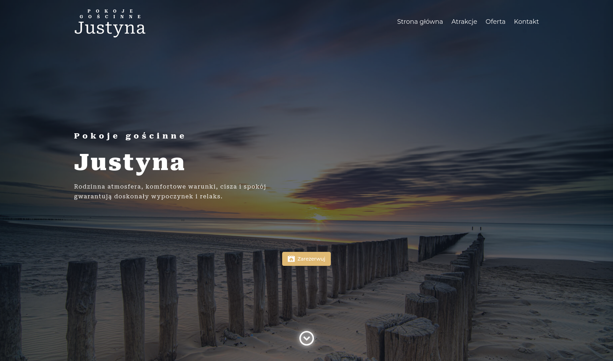

# 🏡 Pokoje Gościnne Justyna

<div align="center">

[](https://nextjs.org)
[](https://payloadcms.com)
[](https://www.typescriptlang.org)
[](https://www.postgresql.org)
[](https://pnpm.io)

</div>

A modern, high-performance website for Pokoje Gościnne Justyna built with Next.js 13 and Payload CMS as a headless content management system.

## 📷 Screenshots

<!-- Add a screenshot of your website here -->
<div align="center">
  
  <p><i>Homepage of Pokoje Gościnne Justyna website</i></p>
</div>

## 🚀 Quick Start

```bash
# Install dependencies
pnpm install

# Set up environment variables (see Environment Variables section)
cp .env.example .env  # then edit .env with your values

# Run development server
pnpm dev

# Build for production
pnpm build
pnpm start
```

## 🛠️ Commands

| Command      | Description              |
| ------------ | ------------------------ |
| `pnpm dev`   | Start development server |
| `pnpm build` | Build for production     |
| `pnpm start` | Start production server  |
| `pnpm lint`  | Run ESLint               |
| `pnpm test`  | Run tests                |

## 🔑 Environment Variables

| Variable               | Description                                      |
| ---------------------- | ------------------------------------------------ |
| `DATABASE_URL`         | PostgreSQL connection string                     |
| `PAYLOAD_SECRET`       | Secret key for Payload CMS                       |
| `NEXT_PUBLIC_SITE_URL` | Public site URL for canonical links and sitemaps |
| `SMTP_HOST`            | SMTP server host (for email functionality)       |
| `SMTP_PORT`            | SMTP server port                                 |
| `SMTP_USER`            | SMTP username                                    |
| `SMTP_PASS`            | SMTP password                                    |

## 📁 Project Structure

<details>
<summary>Click to expand project structure</summary>

```
src/
├── payload.config.ts     # Payload CMS configuration
├── payload-types.ts      # Generated TypeScript types
├── collections/          # Payload collections
│   ├── Pages/
│   ├── Posts/
│   ├── Media.ts
│   ├── Opinions.ts
│   └── Users/
├── blocks/               # Reusable content blocks
│   ├── RenderBlocks.tsx
│   ├── ArchiveBlock/
│   ├── Banner/
│   ├── CallToAction/
│   └── ...
├── components/           # UI components
├── app/                  # Next.js app directory
│   ├── (frontend)/       # Public website
│   ├── (payload)/        # Admin UI
│   └── api/              # API routes
├── endpoints/            # Custom endpoints
├── plugins/              # Payload plugins
└── utilities/            # Helper functions
```

</details>

## 💻 Development

### Admin Access

- Admin UI: Navigate to `/admin` while running the project
- Default credentials: Check your seed data or create a new admin user

### Development Workflow

- **Collections**: Add or modify collections in `src/collections`. Access control helpers are in `src/access`.
- **Blocks & Components**: Keep block configs and React components together for consistent rendering.
- **Type Generation**: Regenerate `payload-types.ts` after schema changes.

## 🚢 Deployment

1. Set all required environment variables in your hosting environment
2. Build the application: `pnpm build`
3. Start the production server: `pnpm start`
4. Ensure PostgreSQL database is accessible via `DATABASE_URL`

## 🔗 Additional Resources

- [Payload CMS Documentation](https://payloadcms.com/docs)
- [Next.js Documentation](https://nextjs.org/docs)
- [PostgreSQL Documentation](https://www.postgresql.org/docs/)

## 📄 License

[](./LICENSE)

This project is licensed under the MIT License — see the [LICENSE](./LICENSE) file for details.

---

<div align="center">
<sub>Built with ❤️ using Next.js and Payload CMS</sub>
</div>
